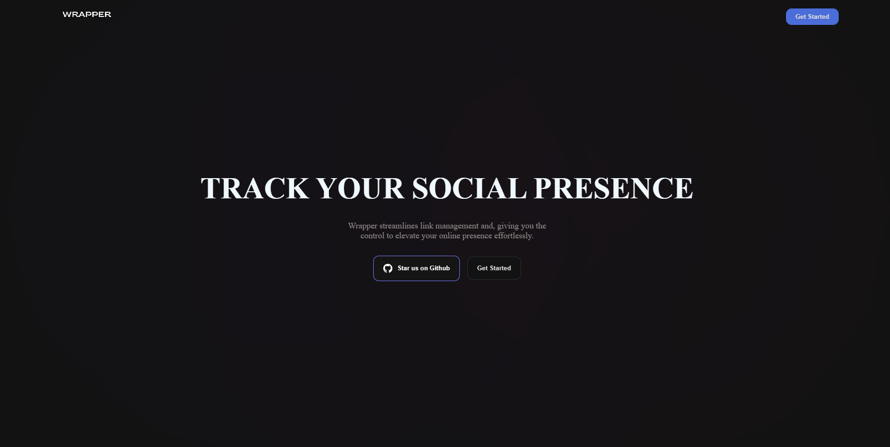
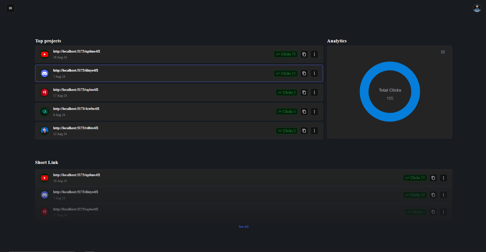
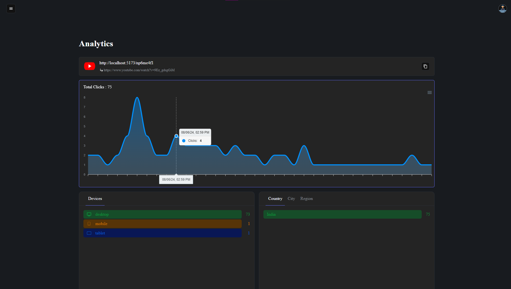
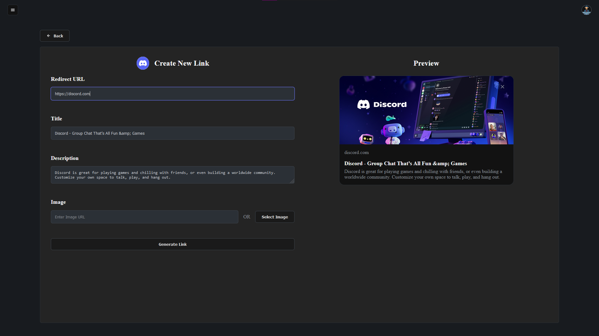
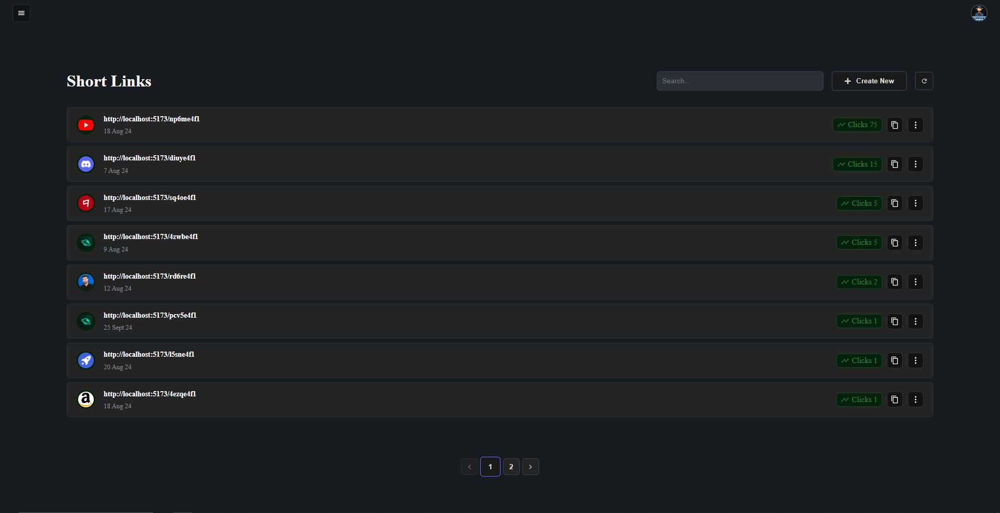

---

# Wrapper: A Custom URL Shortener & Analytics Dashboard

Welcome to **Wrapper**, a full-stack application that allows users to create, manage, and customize short links effortlessly. Wrapper also provides a powerful analytics dashboard to track and visualize clicks based on location, device type, and more.

## Features

### 🔗 **Short Link Management**

-   Create shortened URLs with ease.
-   Update and customize link thumbnails, titles, and descriptions.
-   Manage all your links in one place.
-   Share links via QR Code.

### 📊 **Analytics Dashboard**

-   **Clicks Overview:** Track the total number of clicks on each link.
-   **Geolocation Insights:** See where your users are coming from (country, Region and city).
-   **Device Analytics:** Identify the types of devices your users use.

### 🚀 **Real-Time Data Integration**

-   Utilize the `ipinfo` API to gather user location and device information dynamically.

---

## ⚙ Tech Stack

| **Category**  | **Technology**          |
| ------------- | ----------------------- |
| **Frontend**  | React, TypeScript, SCSS |
| **Backend**   | Express, Node.js        |
| **Database**  | MongoDB                 |
| **APIs Used** | ipinfo API              |

---

## Screenshots



---



---



---



## Installation and Setup

### Prerequisites

Ensure you have the following things:

-   **Node.js**: Version 18 or higher - download Node.js from [nodejs.org](https://nodejs.org)
-   **MongoDB_URI**: You need MongoDB URI to connect with your MongoDB database. refer to [this](https://docs.mongodb.com/manual/reference/connection-string/)
-   **Cloudinary**: You need Cloudinary API key to upload images. refer to [this](https://cloudinary.com/documentation/react_integration)
-   **IpInfo_API**: You need ipinfo API key to collect Geolocation Insights. refer to [this](https://ipinfo.io/)

### Steps to Set Up Locally

1. **Clone the Repository**

    ```bash
    git clone https://github.com/MK884/wrapper.git
    ```

2. **Install Dependencies**  
   Navigate to both `client` and `server` directories to install dependencies:

    ```bash
    cd client
    npm install
    cd ../server
    npm install
    ```

3. **Environment Variables**

    1. Create a Copy of `.env.example` from root directory:

    ```env
    cp server/.env.example server/.env
    cp client/.env.example client/.env
    ```

    2. Fill in the environment variables:

        Open the newly created .env files in both the server and client folders and replace placeholder values like with your actual environment-specific values.

4. **Start the Application**  
   Start both the frontend and backend servers:

    ```bash
    # Start Backend
    cd server
    npm run dev

    # Start Frontend
    cd client
    npm run dev
    ```

    The application will be available at [http://localhost:3000](http://localhost:3000).

---

## Usage

1. **Sign Up / Log In**

    - Create an account or log in to access the platform.

2. **Create Short Links**

    - Use the dashboard to generate short URLs and customize metadata.

3. **View Analytics**
    - Open the analytics tab to explore location, device type, and click trends.

---

Enjoy using **Wrapper**! 🎉
